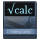

 Booster-Calculator
===================

<br>

Booster-Calculator or Steam-Booster-Profit-Calculator (SBPF) calculates the most profitable booster depending on the games the user owns. It provides information on how much a booster-pack will cost in gems or the chosen currency. It also provides information how much a single card will cost for selling and buying (lowest price, average price, highest price).

<br>

>**Notice:** You can´t run this booster-calculator currently without the needed datasets. I will update this respository as soon as I can provide all the needed booster-data. I´m planning to provide as less data as possible so this booster-calculator will be as fast as possible.

<br>

What you need to run the booster-calculator:
-------------

1. Get your Steam-WebAPI Token [here][3] and insert it into **getBoosterData.php** <br>
at ```$steamapi_key = 'insertyourapikeyhere';```
 
2. Set your login-credentials for your database **db_config.php**
(to be safe place this file outside of your webfolder and change the ```include_once 'db_config.php';``` in **db_connect.php** so it matches your chosen path)

3. Obviously you need a webserver with php-module and a databse (MySQL, MariaDB, ...)

<br>

> **Help us:** If you want to help, just provide us your dataset of gem-amounts per Booster-Pack. You can easily obtain these informations. It will only take you one minute.

> **Just follow these steps:**
> 
> 1. Login to Steam with your User-Account
> 2. Go to [Boostercreator][1]
> 3. Open your browser-console
> Chrome: <kbd>CTRL+SHIFT+J</kbd> Firefox: <kbd>CTRL+SHIFT+K</kbd>
> 4. Insert the following code and press enter
> 5. Post your output on [pastebin.com][2] or somewhere else
> 6. Comment your URL
> ```javascript
> var gem_amounts = $J('#footer + script').text(); var sub1 = gem_amounts.substring(gem_amounts.indexOf('[{')); var sub2 = sub1.substring(0, sub1.indexOf('],')) + "]"; $J('body').append("<textarea style='height: 200px; width: 90%; position: absolute; z-index: 9000; background-color: black; color: green; top:0; overflow:auto;'>"+sub2+"</textarea>");
> ```

  [1]: http://steamcommunity.com/tradingcards/boostercreator/
  [2]: http://pastebin.com/
  [3]: http://steamcommunity.com/dev/apikey

